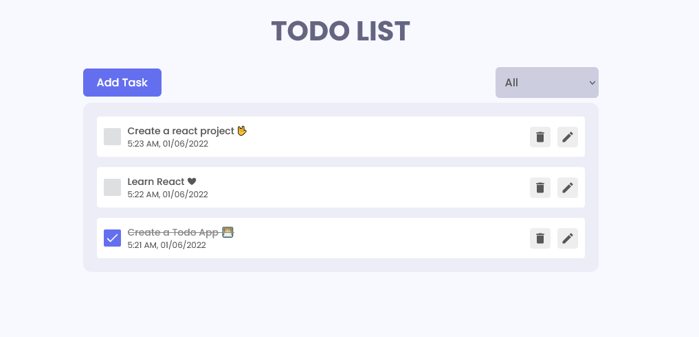

# React Todo App.


---

### Made with ❤️ by [Irwant](https://connect-to-irwant.irwantamami.repl.co/)


---

## Project Description

In the project, we will be creating a Complete Todo Application with all features. We will do all the CRUD operations. We will to use `React.js` and to manage our states, we will use `Redux`. Also we will learn to make simple animations using `Framer Motion`. This will be a complete `beginner` friendly app. Hope you enjoy it.

## What we are going to learn/use

- [React](https://reactjs.org/)
- [React Redux](https://redux.js.org/)
- [Framer Motion](https://framer.com/motion/)
- [React icons](https://react-icons.netlify.com/)
- [React Hot Toast](https://react-hot-toast.com/)
- More...

## Requirements

- Basic ReactJs knowledge
- Basic HTML, CSS knowledge


After getting the starter files, you need to go the file directory and run

```shell
npm install
```

and after that start the dev server.

```shell
npm start
```

## Tools Used

1. Favicon: [Flaticon.com](https://www.flaticon.com/)
1. Code Editor: [VS Code](https://code.visualstudio.com/)


## FAQ


### Q: Who the project is for?

The project is for the people who wanna get more skilled in `ReactJs`.

---

## Feedback

If you have any feedback, please reach out to us at (https://connect-to-irwant.irwantamami.repl.co/)


Happy Coding! 🚀
